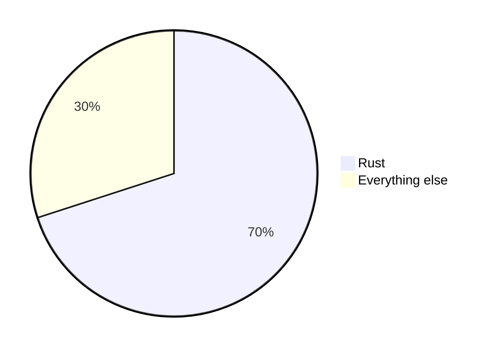

# mdcast

Markdown → **DOCX · ODT · PDF · PDF-presentation · PPTX · reveal.js HTML**, in
one async Rust library and a thin CLI on top of it.

The pitch:

- **One markdown source, six outputs.** Write once, render to whatever the
  audience reads.
- **Per-page layout system.** Tag a page `hero`, `image-full`, `callout`,
  `thanks` — and have it honoured across every output format.
- **Pluggable everything.** Templates, images, reveal.js distribution — all
  fetched through one async `AssetProvider` trait. Your app feeds bytes from
  a DB, S3, an in-memory map, whatever.
- **Single self-contained HTML.** Reveal.js dist is bundled; with
  `--embed-resources` (default) the deck is one file with zero external URLs.

mdcast does **not** try to replace pandoc. Pandoc handles DOCX/PPTX/revealjs
because no Rust crate matches its OOXML fidelity. Typst handles PDF because
the LaTeX toolchain is slow and heavy. The value mdcast adds is the
**branding-and-layout layer** that sits on top of both.

## Quick start

PDF targets need nothing extra — the Typst compiler is embedded in the
library. Only the pandoc-backed targets (docx/odt/pptx/html-reveal) need the
`pandoc` binary:

```sh
yay -S pandoc        # arch
brew install pandoc  # macos
apt install pandoc   # debian/ubuntu
```

Build and render:

```sh
cargo build --release
./target/release/mdcast render slides.md \
    --target html-reveal \
    --out slides.html \
    --assets ./my-images/
```

You'll get a single self-contained `slides.html` you can open in any browser.

## A minimal markdown example

```markdown
<page class="hero">
# Q3 Operations Review

*F13 — for board discussion*
</page>

---

# Agenda

- Headlines
- Margins
- Open questions

---

# {.image-full}


---

> A simple plan, decisively executed, beats a perfect plan that ships late.

---

Closing remarks and next steps.
```

What you get with no extra config:

| Page | Class           | Why                                                     |
|------|-----------------|---------------------------------------------------------|
| 1    | `hero`          | Explicit `<page class="hero">` wrapper                  |
| 2    | `content`       | Default (no rule matched)                               |
| 3    | `image-full`    | Page body is just one image → shape rule                |
| 4    | `callout`       | Body is just a blockquote → shape rule                  |
| 5    | `thanks`        | Last page, no explicit class → positional rule          |

Run `mdcast explain slides.md` to print this table for any file.

## Frontmatter

A leading YAML block is stripped before the page splitter runs, so it never
becomes a phantom `hero` page:

```markdown
---
title: Q3 Operations Review
author: F13
date: 2026-07-03
---

# Real first page
```

Only a flat `key: value` subset is parsed — `title`/`author`/`date` populate
`DocMeta`, any other keys land in `DocMeta::extra`. Pandoc targets pass
`title`/`author`/`date` through as `--metadata` (revealjs `<title>`,
docx/pptx document properties). No frontmatter block → `DocMeta` stays
default, same as before.

## Page boundaries and classes

Two surface syntaxes, both accepted:

- HTML-style: `<page class="hero">…</page>`
- Pandoc fenced div: `::: {.hero}` … `:::`

Outside an explicit wrapper, **`---` thematic breaks split pages.** The
auto-classifier then fills in a class:

1. **Explicit class** (from a wrapper) — always wins.
2. **Content shape** — `single_h1_only` → `section-divider`,
   `single_image_only` → `image-full`, `single_blockquote_only` → `callout`.
3. **Positional** — first page → `hero`, last page → `thanks`.
4. **Default** — `content`.

All rules live in `brand.toml`:

```toml
[auto_layout]
first   = "hero"
last    = "thanks"
default = "content"

[[auto_layout.rules]]
when  = "single_h1_only"
class = "section-divider"

[[auto_layout.rules]]
when  = "single_image_only"
class = "image-full"
```

## Built-in classes

| Class             | Where it shows up                                    |
|-------------------|------------------------------------------------------|
| `hero`            | Title / cover                                        |
| `content`         | Body pages — paragraphs, lists, the usual            |
| `thanks`          | Closing                                              |
| `image-full`      | Full-bleed image                                     |
| `section-divider` | Single-heading section break                         |
| `callout`         | Pull-quote / emphasised single block                 |

A class name resolves to a *different template per target*. The same
`<page class="hero">` produces:

- a centred large-type cover **in PDF** (via `typst/layouts/pdf/hero.typ`)
- a dark-background title slide **in PDF-presentation** (via
  `typst/layouts/pdf-presentation/hero.typ`)
- a `<section class="hero">` **in reveal.js** (styled by the theme CSS)
- a `Hero` paragraph-style **in DOCX/ODT** (from the reference doc)

Missing template for some class? The renderer logs a warning and falls back
to `content`. Authors are never blocked.

## Branding reveal.js decks (issue #57)

`html-reveal` projects `BrandSpec` (the same `brand.toml` that drives
page-classification rules) into a generated CSS layer plus an optional logo
overlay — no new pandoc invocation, no template changes. A document with no
`--brand` (or a `brand.toml` with no `palette`/`fonts`/`logo`) renders
byte-identical to before this existed.

**Palette/font mapping.** Recognised `[palette]`/`[fonts]` keys map onto
reveal.js 4.x's own theme CSS custom properties, scoped to `.reveal`:

| `brand.toml` key      | reveal.js custom property         |
|------------------------|-----------------------------------|
| `palette.background`   | `--r-background-color`            |
| `palette.heading` (falls back to `palette.primary`) | `--r-heading-color` |
| `palette.text`         | `--r-main-color`                  |
| `palette.link`         | `--r-link-color` / `--r-link-color-hover` |
| `palette.accent`       | `--r-selection-background-color`  |
| `fonts.body`            | `--r-main-font`                   |
| `fonts.heading`         | `--r-heading-font`                |
| `fonts.code`            | `--r-code-font`                   |

Every `[palette]` key is *also* emitted as `--brand-<key>`, so per-class CSS
can reach a color the table above doesn't know about (see below).

**Logo overlay.** An optional `[logo]` table in `brand.toml`:

```toml
[logo]
key = "img/logo.svg"     # an AssetProvider key — same namespace image refs use
position = "top-right"   # top-right (default) | top-left | bottom-right | bottom-left
width = "120px"          # optional
```

The backend fetches `key` through the `AssetProvider`, embeds it as a data
URI, and overlays it on every slide via `position: fixed`. A key missing from
the provider logs a `tracing::warn!` and the render proceeds without a logo —
never a hard failure.

**Per-class CSS escape hatch.** Slides already carry `{.<class>}` from the
page's class (`<section class="hero">` etc.), so hand-written CSS can target
it directly:

```css
.reveal section.hero { text-align: left; }
.reveal section.callout { background: var(--brand-accent); }
```

Provide such CSS by giving the `AssetProvider` a `revealjs/brand.css` key —
its contents are appended verbatim to the generated `<style data-brand>`
block. This is the only per-class hook for reveal.js; there is no per-class
template like typst's layouts.

## Typst layout context: `doc-meta` / `brand` / `asset-path`

Every typst render (`pdf`, `pdf-presentation`) registers a synthetic
`/context.typ` source alongside the per-class layouts, built from
`ResolvedDoc.meta` (`DocMeta`), `.brand` (`BrandSpec`), and `.assets`
(`Vec<AssetRef>`). A layout opts in with an `#import` — layouts that don't
import it are completely unaffected, so third-party `.typ` files with the
plain `layout(body)` signature keep working with no changes:

```typst
#import "/context.typ": doc-meta, brand, doc-meta-get, brand-color, brand-font, asset-path

#let layout(body) = [
  #doc-meta.title           // "" if frontmatter set no title
  #doc-meta.author
  #doc-meta.date
  #doc-meta.classification  // any DocMeta.extra key, flattened onto doc-meta
  #brand.name
  #brand.palette.navy       // "" — a raw hex string like "#243752", not a color
  #brand.fonts.sans

  // Safe accessors — missing keys degrade to the given default instead of
  // erroring, which matters for `extra`/`palette`/`fonts` since those come
  // from the frontmatter/brand.toml a given document happens to set:
  #doc-meta-get("classification", default: "internal")
  #text(fill: brand-color("navy", default: black))[...]
  #set text(font: brand-font("sans", default: "New Computer Modern"))

  // A provider-supplied asset (logo, background) the layout owns directly —
  // not something referenced from the markdown body. `asset-path` degrades
  // to `none` for a key that was never declared or that the provider
  // couldn't resolve, so wrap it in an `if` rather than calling `#image`
  // unconditionally.
  #let logo = asset-path("branding/logo.svg")
  #if logo != none [#image(logo, width: 3cm)]
]
```

- `doc-meta.title` / `.author` / `.date` are always present (empty string if
  unset). Every other `DocMeta.extra` key (`subtitle`, `classification`, …)
  is flattened onto the same dict, so `"classification" in doc-meta` /
  `doc-meta.at("classification", default: "")` both work.
- `brand.name`, `brand.palette` (name → hex string), and `brand.fonts` (name
  → family string) mirror `BrandSpec` from `brand.toml` as-is — `rgb(...)`
  the palette values yourself, or use `brand-color(key, default: ...)`, which
  does that for you and returns `default` for a missing key.
- The built-in `hero` and `content` layouts (both targets) already use this:
  `hero` centres `doc-meta.author`/`.date` under the title and themes it via
  `brand-color("accent", ...)` / `brand-font("sans", ...)`; `content` renders
  a running header with `doc-meta.title` and a `classification` extra key
  when either is set. A document with no frontmatter and no `brand.toml`
  renders identically to before this existed — every accessor's default
  reproduces the prior hardcoded value.
- `asset-path(key, default: none)` resolves a `ResolvedDoc.assets` entry —
  each `AssetRef { key }` is fetched through the same `AssetProvider` as
  everything else and registered as a virtual file, so a layout reaches it
  by the exact key the document declared (`"branding/logo.svg"`, not a
  sanitized internal path). Both SVG and raster images work — `#image(...)`
  doesn't care which. A key the provider has no bytes for is dropped with a
  `tracing::warn!` instead of failing the render, so a missing logo degrades
  to whatever `default:` the layout passes rather than breaking the PDF.
  This is layout chrome, distinct from `images.rs`'s page-body image
  resolution: an asset here isn't referenced from markdown, and pandoc
  targets ignore `ResolvedDoc.assets` entirely.

## Brand fonts (self-contained PDFs)

By default the typst backend resolves `#set text(font: "...")` against
whatever fonts `typst-kit` finds on the render host, plus typst's own
embedded defaults — so a branded PDF depends on the host having the brand
font installed. `ResolvedDoc.fonts: Vec<AssetRef>` lets a consumer supply the
font faces themselves, resolved through the same `AssetProvider` as
everything else, so the PDF is reproducible regardless of the render host:

```rust
let doc = ResolvedDoc {
    // Each entry is a `.ttf`/`.otf` asset key fetched through the provider
    // and registered with the typst font book before compiling.
    fonts: vec![AssetRef { key: "fonts/Montserrat-Regular.ttf".into() }],
    /* .. */
    # pages: vec![], meta: DocMeta::default(),
    # brand: BrandHandle(std::sync::Arc::new(BrandSpec::default())), assets: vec![], toc: None,
};
```

- Registered fonts take precedence over host-discovered/embedded fonts for an
  exact family match — a layout's `#set text(font: "Montserrat")` resolves to
  the supplied face even when "Montserrat" also happens to be installed on
  the host.
- A key the provider has no bytes for, or that isn't a font `ttf_parser` can
  parse, is silently skipped — typst falls back to host/embedded search for
  that family (and warns `unknown font family: ...` if nothing matches
  anywhere), the same degrade-not-fail treatment as a missing layout asset.
- `Vec::new()` (the default) is a no-op: identical to the pre-existing
  host-plus-embedded-only behaviour.
- Typst-only: pandoc backends render text with whatever font the target
  document format resolves (a DOCX/ODT/PPTX style, or the reveal.js theme
  CSS) and ignore `ResolvedDoc.fonts` entirely.

## Mermaid diagrams (`mermaid` feature)

With the `mermaid` feature (on by default), mdcast can render
```` ```mermaid ```` fenced code blocks to SVG diagrams via the pure-Rust
[`mermaid-svg`](https://crates.io/crates/mermaid-svg) crate — no Node.js, no
Chromium, no external binary. It's a pre-step ahead of the page splitter, so
the auto-classifier sees a real image node (a diagram-only page classifies
`image-full`) and both engines embed the SVG through the same asset pipeline
as any other image, in every target.

````markdown

````

CLI: pass `--mermaid` to `render` / `explain` (opt-in per invocation — a
document's fences are otherwise left as ordinary code blocks). Library:
call `mermaid::render_diagrams(md)` before splitting; it returns the
rewritten markdown plus `(key, bytes)` pairs (`mermaid/diagram-N.svg`, in
document order) to serve from your provider stack:

```rust
let rendered = mdcast::mermaid::render_diagrams(&md);
let svgs: std::collections::HashMap<_, _> = rendered.svgs.into_iter().collect();
let provider = mdcast::LayeredAssets {
    over: mdcast::sync_provider(move |k| Ok(svgs.get(k).cloned())),
    base: mdcast::EmbeddedAssets,
};
// split/classify rendered.markdown as usual, then render with `provider`
```

A diagram that fails to parse/render logs a `tracing::warn!` and keeps its
fence (it degrades to a plain code block in the output) — one bad diagram
never fails the render. Supported diagram types (pie, sequence, flowchart,
state, class, ER, gantt, …) are whatever the bundled `mermaid-svg` version
supports — see its [gallery](https://docs.rs/mermaid-svg).

## Remote images (`remote-images` feature, issue #54)

A page-body `` / `` reference is never
resolved through the `AssetProvider` — it isn't a provider key. What happens
to it next depends on the target and this feature:

| Target       | `remote-images` off (default)                              | `remote-images` on                                          |
|--------------|--------------------------------------------------------------|---------------------------------------------------------------|
| pandoc (docx/odt/pptx/html-reveal) | URL left in the markdown; pandoc fetches it itself at conversion time (needs network on the render host) | Fetched once by mdcast, materialised to a temp file, markdown rewritten to the local path — pandoc never touches the network |
| typst (pdf/pdf-presentation) | Unresolved: `tracing::warn!` with the URL, image dropped from the render (no placeholder text leaks into the artifact) | Fetched once by mdcast and registered as a virtual file, same as any other image |

Enable it with `cargo build --features remote-images` (pulls in `reqwest`,
off by default — no new dependency, byte-identical output for documents
without remote images). Once enabled, `images::collect_images` fetches every
unique `http(s)` URL referenced across a page set exactly once (same dedup as
provider-resolved images) and folds the bytes into the same map both engines
already draw from — so a remote image renders identically in every target
from one input, and an offline render sees the same input regardless of
target. A fetch failure (DNS, 404, timeout, …) warns and is skipped; it never
fails the render — one dead link shouldn't sink a 40-page document.

**SSRF note for server embedders:** fetching a caller-controlled URL from your
server is a request-forgery vector (it can probe internal network addresses).
The feature is opt-in for that reason; if you enable it in a server context,
front it with your own URL allow/deny-list policy before the markdown ever
reaches mdcast.

## Image formats

mdcast never validates or transcodes image bytes — they flow from the
`AssetProvider` straight to the target engine, so what "attaching an image"
supports is whatever that engine/viewer accepts. Verified against typst
0.14's format table and pandoc's pass-through behaviour:

| Format | pdf / pdf-presentation (typst) | docx (Word) | odt (LibreOffice) | pptx | html-reveal |
|---|---|---|---|---|---|
| PNG, JPEG, GIF | ✓ | ✓ | ✓ | ✓ | ✓ |
| SVG (+svgz on typst) | ✓ | ✓ modern Word | ✓ | ✓ modern PowerPoint | ✓ |
| WebP | ✓ | ✗ broken image icon | ✓ LO ≥ 7.4 | ✗ | ✓ |
| PDF-as-image | ✓ | ✗ | ✗ | ✗ | ✗ |
| BMP, TIFF | ✗ compile error | ✓ | ✓ | ✓ | browser-dependent |
| AVIF / HEIC | ✗ compile error | ✗ | ✗ | ✗ | AVIF ✓, HEIC ✗ |

Two failure modes fall out of this:

- **Unsupported format on typst** → a compile error, `unknown image format`,
  naming no file. Typst detects format by extension, falling back to magic
  bytes — `images::sanitize_key` preserves the original extension, so
  detection itself isn't the gap, support is.
- **WebP into docx/pptx** → renders fine to PDF, embeds without complaint,
  shows a broken-image icon in Word/PowerPoint. A silent per-target
  degradation from one source document.

To catch the second failure mode before it reaches a viewer, `images::collect_images`
sniffs each fetched image's magic bytes and emits one `tracing::warn!` (naming
the image key, detected format, and target) whenever the combination is
known-unsupported per the table above — WebP→docx/pptx, PDF-as-image→
everything but the typst targets, BMP/TIFF→pdf/pdf-presentation,
AVIF/HEIC→everything but their one supported target. It
warns rather than fails: the embed may be intentional (a document destined
only for LibreOffice, say). Combinations the table leaves ambiguous
(browser-dependent TIFF support in html-reveal, LibreOffice-version-gated
WebP) are left un-warned rather than guessed at. This is a detection sniff
only — no transcoding (e.g. WebP → PNG re-encode) is performed; fix the
source image if a warning fires.

## Table of contents

`ResolvedDoc.toc: Option<u8>` requests a table of contents at the given
heading depth (1-6). `None` (the default) means no TOC — output is
byte-identical to before this field existed. Each backend honours it in its
own idiom:

| Target                          | Behaviour with `toc: Some(n)`                          |
|----------------------------------|--------------------------------------------------------|
| `docx`, `odt`                    | `pandoc --toc --toc-depth=<n>` — a real TOC field/element |
| `pdf`                            | A leading `#outline(depth: <n>)` page, before page 1    |
| `pdf-presentation`, `pptx`, `html-reveal` | Ignored — slide decks don't get a TOC          |

```rust
let doc = ResolvedDoc { toc: Some(3), /* .. */ };
```

The typst `pdf` outline only lists headings that survive md→typst conversion
(see `.claude/CLAUDE.md`'s Known limitations for the converter's coverage) —
a document with no headings renders an empty outline page.

## Data-driven template rendering (typst only)

Everything above is the markdown pipeline: split into pages, classify,
convert to typst markup, hand each page to a per-class layout. Some documents
aren't markdown at all — an invoice, a certificate, a report — they're a
user-authored typst template rendered over structured data (line items, a
total, a customer address). `mdcast::backends::typst::render_template` is a
parallel entry point into the same engine plumbing (in-process compile,
`AssetProvider`-only file access, `/context.typ` for `DocMeta`/`BrandSpec`)
that bypasses the splitter/classifier/`md_to_typst`/driver entirely — there
are no pages and no `ResolvedDoc` involved:

```rust
use mdcast::backends::typst::{TemplateDoc, render_template};
use mdcast::{BrandHandle, BrandSpec, DocMeta, EmbeddedAssets, LayeredAssets};
# use std::sync::Arc;

# async fn example() -> anyhow::Result<()> {
let doc = TemplateDoc {
    // AssetProvider key of the main .typ file. Its own directory is scanned
    // for siblings it #imports/#images — see below.
    template: "templates/invoice.typ".to_string(),
    // Any serde-serializable value — your "data loader" (a DB row, an API
    // response, …) produces this. mdcast's contract starts at
    // (template, data, brand) → bytes; the data loader itself stays outside
    // the crate.
    data: serde_json::json!({
        "number": "INV-2026-0042",
        "total": "129.99",
        "items": [{"description": "Consulting", "qty": 3, "total": "99.99"}],
    }),
    meta: DocMeta { title: Some("Q3 Services Invoice".into()), ..Default::default() },
    brand: BrandHandle(Arc::new(BrandSpec::default())),
};

let provider = LayeredAssets { over: your_template_provider(), base: EmbeddedAssets };
let artifact = render_template(&doc, &provider).await?;
# Ok(())
# }
# fn your_template_provider() -> impl mdcast::AssetProvider {
#     mdcast::sync_provider(|_| Ok(None))
# }
```

The template itself reads the data with typst's own `json()` — no custom
serialization dialect to design or escape (unlike `/context.typ`'s flat
string-dict projection, which doesn't scale to arbitrary nested JSON):

```typst
#import "/context.typ": doc-meta, brand-color
#let invoice = json("/data.json")

= Invoice #invoice.number
#doc-meta.title

#table(
  columns: (1fr, auto, auto),
  ..invoice.items.map(it => (
    [#it.description], [#str(it.qty)], [#it.total],
  )).flatten(),
)
#text(fill: brand-color("accent"))[Total due: #invoice.total]
```

- `/context.typ` (`doc-meta`, `brand`, and the `doc-meta-get`/`brand-color`/
  `brand-font` accessors) works identically to the markdown pipeline — see
  "Typst layout context" above. `asset-path` always degrades to its
  `default:` in template mode: there's no `ResolvedDoc.assets` here, since a
  template has no per-class layout to declare chrome for. A template reaches
  its own images/logos through sibling files instead (below).
- **Sibling files resolve through the `AssetProvider`.** Anything the main
  template `#import`s or `#image`s — a shared `partials/header.typ`, a
  `logo.svg` — is discovered by listing the template's own directory
  (`AssetProvider::list` scoped to everything up to the last `/` in
  `template`) and registered at the same virtual path as its provider key, so
  a relative reference resolves exactly as it would on a real filesystem.
  `.typ` siblings register as typst sources; everything else registers as a
  binary file. A template key with no `/` has no directory to scope
  discovery to, so every provider key is listed — fine for a small
  filesystem-backed provider, wasteful against a large embedded catalog, so
  keep templates under their own subdirectory (`templates/`).
- A missing `template` key fails with a clear error naming the key; a
  missing sibling reference fails typst compilation with its own diagnostic
  (unlike a missing layout asset or brand font, which degrade silently —
  there's no sensible default for a template's own body content).
- Scope: PDF by default. Behind the off-by-default `typst-html` cargo
  feature, the same template also exports to HTML — see below.

### HTML export (`typst-html` feature, issue #53)

A document rendered from a template often needs a **web representation**
too — an invoice as a PDF attachment *and* as an HTML page in a customer
portal. `render_template_html` is the same contract as `render_template`
(same `TemplateDoc`, same `AssetProvider` resolution, same `/data.json`/
`/context.typ` virtual files) with only the final export step swapped —
`typst_pdf::pdf(...)` becomes `typst_html::html(...)`. One template, two
outputs, no second source of truth to maintain:

```rust
# #[cfg(feature = "typst-html")]
# {
use mdcast::backends::typst::render_template_html;
# async fn example(doc: &mdcast::backends::typst::TemplateDoc, provider: &impl mdcast::AssetProvider) -> anyhow::Result<()> {
let artifact = render_template_html(doc, provider).await?;
// artifact.primary: Bytes of the HTML page, artifact.filename: "output.html"
# Ok(())
# }
# }
```

This is off by default: enable it with `--features typst-html`. It pulls in
the `typst-html` crate and turns on `typst-as-lib`'s own `typst-html`
feature, which flips `typst::Feature::Html` on for the whole process (every
`TypstEngine` built anywhere in the crate, not just template renders) —
that's what makes the `target()` function below available at all. With the
feature off, the dependency tree and every other code path are unchanged.

Typst's HTML export is **experimental** and semantic-first — it does not try
to reproduce paged output in a browser:

- `#set page(...)`, headers/footers, and `#place(...)` absolute positioning
  are paged-only concepts with no HTML equivalent. Constructs like these are
  silently skipped by the exporter *if evaluated* — see the `target()`
  pattern below for keeping them out of the HTML path entirely, since
  merely being unsupported doesn't stop them from executing.
- Visual styling comes through only partially. A web-faithful rendering will
  usually pair the exported HTML with the embedder's own CSS. `html.elem`
  and `html.frame` (render a region to inline SVG) are available in HTML
  mode for the places where typst's own semantics aren't enough — see
  [typst's HTML export docs](https://typst.app/docs/reference/html/).
- Compiler warnings from HTML-unsupported constructs (e.g. "place was
  ignored during HTML export") surface through the same `tracing::warn!`
  path as every other typst diagnostic in this crate — they are not
  swallowed.
- Output may shift across typst versions — expected for an experimental,
  opt-in upstream feature.

**Writing a dual-target template.** Branch on typst's `target()` function
(itself part of the HTML feature) so one template body serves both exports;
keep the branch coarse (chrome vs. no chrome) rather than sprinkling
`target()` checks through the data-driven content itself:

```typst
#import "/context.typ": doc-meta
#let invoice = json("/data.json")

#context if target() == "html" [
  // Semantic web chrome — no #set page, no #place. html.elem(...) is
  // available here for anything typst's own tags don't cover.
  = Invoice #invoice.number
] else [
  // Paged chrome — margins, running headers, absolute-positioned footers.
  #set page(margin: 2cm)
  #place(top, text(size: 9pt)[#doc-meta.title])
  = Invoice #invoice.number
]

// Shared, target-agnostic body: headings, tables, text render the same
// either way.
#table(
  columns: (1fr, auto, auto),
  ..invoice.items.map(it => ([#it.description], [#str(it.qty)], [#it.total])).flatten(),
)
```

### CLI

```
mdcast render-template templates/invoice.typ --data invoice.json --out invoice.pdf [--assets DIR] [--brand brand.toml] [--format pdf|html]
```

`--data` is a JSON file deserialized straight into `TemplateDoc.data`.
`--assets DIR`/`--brand` work exactly as they do for `render` above.
`--format` defaults to `pdf`; `html` is only a valid value when `mdcast` was
built with the `typst-html` feature (`cargo build --features typst-html`) —
otherwise clap rejects it as an unknown value.

## Library usage

```rust
use std::path::Path;
use std::sync::Arc;

use mdcast::backends::Registry;
use mdcast::pages::{auto::classify, splitter::DefaultSplitter};
use mdcast::{
    AssetRef, BrandHandle, BrandSpec, DocMeta, EmbeddedAssets, LayeredAssets,
    PageSplitter, RenderRequest, ResolvedDoc, Target, async_provider,
};
use bytes::Bytes;
use anyhow::Result;

#[tokio::main]
async fn main() -> Result<()> {
    // 1. Parse → pages → classify.
    let md = tokio::fs::read_to_string("slides.md").await?;
    let raw = DefaultSplitter.split(&md);
    let brand = BrandSpec::default();
    let pages = classify(raw, &brand.auto_layout);

    let doc = ResolvedDoc {
        pages,
        meta: DocMeta { title: Some("Q3 Review".into()), ..Default::default() },
        brand: BrandHandle(Arc::new(brand)),
        // Declare a brand logo typst layouts can reach via `asset-path("branding/logo.svg")`
        // (see "Typst layout context" above). `Vec::new()` if no layout needs one.
        assets: vec![AssetRef { key: "branding/logo.svg".into() }],
        // Brand font faces to register with the typst font book (see "Brand
        // fonts" above). `Vec::new()` for host/embedded font search only.
        fonts: vec![AssetRef { key: "fonts/Montserrat-Regular.ttf".into() }],
        toc: None, // Some(3) to request a 3-level-deep table of contents
    };

    // 2. Compose an asset provider — fetch images from your app, fall back to
    //    the built-in templates and reveal.js dist.
    let app_provider = async_provider(|key: String| async move {
        // your code: hit a DB, S3, an in-memory cache, an image renderer …
        if let Some(bytes) = your_app_lookup(&key).await? {
            Ok::<_, anyhow::Error>(Some(Bytes::from(bytes)))
        } else {
            Ok(None)
        }
    });
    let provider = LayeredAssets { over: app_provider, base: EmbeddedAssets };

    // 3. Render.
    let registry = Registry::with_defaults();
    let req = RenderRequest {
        doc: &doc,
        assets: &provider,
        out: Path::new("slides.html"),
    };
    let artifact = registry.render(Target::HtmlReveal, &req).await?;
    println!("wrote {}", artifact.primary.display());
    Ok(())
}

# async fn your_app_lookup(_: &str) -> Result<Option<Vec<u8>>> { Ok(None) }
```

### Server embedding: render straight to bytes

A server handling a render request doesn't want a file on disk — it wants
bytes to put in a response body. `Registry::render_to_bytes` skips the
temp-dir dance entirely: Typst PDFs are already produced in memory, and the
pandoc temp lifecycle (input file, reference doc, subprocess output) is owned
internally and cleaned up before the call returns.

```rust
let registry = Registry::with_defaults();
let artifact = registry.render_to_bytes(Target::HtmlReveal, &doc, &provider).await?;
// artifact.primary: Bytes, artifact.filename: "output.html"
respond_with(artifact.filename, artifact.primary);
```

`RenderRequest`/`registry.render(...)` (the path-based API used above) is
implemented on top of this — one render path, two ways to collect the
result.

Anything the provider returns `None` for falls through to the next layer.
`EmbeddedAssets` is always at the bottom and ships:

- Built-in Typst layouts (`hero`, `content`, `thanks`, `image-full`,
  `section-divider`, `callout`) for `pdf` and `pdf-presentation`.
- Minimal reveal.js 4.6.0 distribution (with stripped font imports — falls
  back to system sans-serif).
- Real, branded pandoc reference docs: `reference.docx`/`reference.odt`
  define named paragraph styles for the six built-in classes (`hero`,
  `content`, `thanks`, `image-full`, `section-divider`, `callout`), plus
  `PageBreak` (odt) for page separators; `reference.pptx` brands pandoc's
  seven built-in content-shape layouts (pptx has no per-class layout
  selection — see `.claude/CLAUDE.md`'s Known limitations).

## Cargo features

```toml
[features]
default         = ["pandoc", "typst", "rt-multi-thread", "mermaid"]
pandoc          = []   # DOCX, ODT, PPTX, html-reveal
typst           = []   # PDF, PDF-presentation
typst-html      = []   # render_template_html — experimental HTML export (issue #53), off by default
remote-images   = []   # fetch http(s) page-body images through collect_images (issue #54), off by default
mermaid         = []   # render ```mermaid fences to SVG via mermaid-svg (pure Rust)
rt-multi-thread = []   # tokio multi-threaded runtime; required by the mdcast binary,
                       # library-only consumers can drop it via default-features = false
```

Build with only what you need:

```sh
cargo build --no-default-features --features pandoc   # no typst dep tree
cargo build --no-default-features --features typst    # no pandoc backend
cargo build --features typst-html                     # render_template_html + --format html
cargo build --features remote-images                  # fetch remote page-body images (pulls in reqwest)
```

## Targets

| Target              | Engine     | Notes                                                          |
|---------------------|------------|----------------------------------------------------------------|
| `docx`              | pandoc     | Class = paragraph-style name in `reference.docx`               |
| `odt`               | pandoc     | Class = paragraph-style name in `reference.odt`                |
| `pptx`              | pandoc     | Class = slide-layout name in `reference.pptx`; body placeholders auto-shrink overflowing text (see below) |
| `html-reveal`       | pandoc     | Single self-contained file; reveal.js dist bundled & inlined   |
| `pdf`               | typst      | Per-class typst template under `typst/layouts/pdf/`            |
| `pdf-presentation`  | typst      | Per-class typst template under `typst/layouts/pdf-presentation/` |

A slide with more content than fits its placeholder no longer just overflows
past the slide edge in `pptx` output: after pandoc renders the deck, mdcast
patches each `ppt/slides/slideN.xml`, inserting `<a:normAutofit/>` into every
body placeholder's `<a:bodyPr>` (title placeholders are left alone). That's
the same element PowerPoint's own "Shrink text on overflow" writes — without
a precomputed `fontScale`, so PowerPoint/LibreOffice recompute the actual
shrink amount when the deck is opened.

## CLI

```
mdcast render INPUT.md --target <T> --out OUTPUT [--assets DIR] [--brand brand.toml] [--toc-depth N] [--html-image-tags] [--mermaid] [--layout-asset KEY]... [--layout-font KEY]...
mdcast explain INPUT.md [--brand brand.toml] [--html-image-tags] [--mermaid]
mdcast render-template TEMPLATE --data DATA.json --out OUTPUT [--assets DIR] [--brand brand.toml] [--format pdf|html]
```

Targets: `docx`, `odt`, `pdf`, `pdf-presentation`, `pptx`, `html-reveal`.

`--html-image-tags` enables the built-in `HtmlImageTags` preprocessor:
`` / `<image path="X">` HTML tags are rewritten to
standard `` markdown before page splitting, so the auto-classifier and
both engines see real image nodes.

`--mermaid` renders ```` ```mermaid ```` fenced code blocks to SVG diagrams —
see "Mermaid diagrams" above.

`--layout-asset KEY` (repeatable) declares a `ResolvedDoc.assets` entry —
resolved through `--assets`/the embedded provider and reachable from a typst
layout via `asset-path(KEY)` (see "Typst layout context" above). Ignored by
pandoc targets.

`--layout-font KEY` (repeatable) declares a `ResolvedDoc.fonts` entry — a
`.ttf`/`.otf` asset key resolved through `--assets`/the embedded provider and
registered with the typst font book before compiling (see "Brand fonts"
above). Ignored by pandoc targets.

`render-template` (typst-only; absent when the crate is built without the
`typst` feature) has no markdown involved — see "Data-driven template
rendering" above. `TEMPLATE` is an `AssetProvider` key; `--data` is a JSON
file deserialized into `TemplateDoc.data`. `--format` defaults to `pdf`;
`html` needs the `typst-html` feature — see "HTML export" above.

## Development

All day-to-day commands are wrapped in the `Makefile` — run a bare `make` to
list them:

| Target                  | What it does                                                    |
|-------------------------|-----------------------------------------------------------------|
| `make build` / `release`| Debug / release build (default features = pandoc + typst + mermaid) |
| `make check`            | Fast typecheck (default features)                               |
| `make check-all`        | All feature combinations (core, pandoc, typst, bin-without-mermaid, default, +typst-html, +remote-images) |
| `make fmt` / `lint`     | Apply formatting / fmt-check + clippy with `-D warnings` (default + typst-html + remote-images features) |
| `make test`             | Full suite, default features (unit + integration)               |
| `make test-unit`        | In-module `#[cfg(test)]` tests only                             |
| `make test-integration` | `tests/` suite, incl. engine smoke tests (pandoc-backed ones skip when `pandoc` is absent) |
| `make test-typst-html`  | Tests for the off-by-default `typst-html` feature (HTML export, issue #53) |
| `make test-remote-images` | Tests for the off-by-default `remote-images` feature (http(s) image fetch, issue #54) |
| `make coverage`         | Coverage report: `lcov.info` + terminal summary (needs [`cargo-llvm-cov`](https://github.com/taiki-e/cargo-llvm-cov)); CI runs it only on release PRs |
| `make verify`           | Pre-merge gate: `lint` + `check-all` + `test` + `test-typst-html` + `test-remote-images` — what CI's `test` job runs on every PR and again on merge to `master` |
| `make demo`             | Render the golden fixture to `target/demo/` (html-reveal + pdf) |

`CARGO_BUILD_JOBS` defaults to 4; override with `make build CARGO_BUILD_JOBS=8`.

## What's deferred

These are not bugs — they're chosen scope cuts. Each lands as an additive
change at a seam that already exists (see [`PROJECT_PLAN.md` §10](https://github.com/xmiksay/mdcast/blob/master/PROJECT_PLAN.md#10-future-evolution--with-explicit-triggers) on GitHub).

- PPTX per-class layout selection: pandoc's writer only ever picks from
  seven fixed, content-shape-driven layouts, never by our page class, so
  `reference.pptx` brands those seven instead of adding one layout per class.
  True per-class selection needs post-render patching of each slide's layout
  relationship.
- Full markdown coverage in the md→Typst converter (v1 handles headings,
  emphasis, lists, blockquotes, images, code, tables, links, autolinks, and
  footnotes; raw HTML blocks are not yet projected — their text comes through
  unstyled).
- Mermaid → SVG pre-processing (a Rust renderer the team already owns will
  plug in as a pre-step).
- Brand projection (one `brand.toml` colour change → propagated to all
  outputs).
- Caching (content-hashed diagram + output cache).
- HTML export for the markdown pipeline's `pdf` target (issue #53 only adds
  it to `render_template` — the data-driven entry point). The markdown path
  has per-class layouts and a `md_to_typst` conversion step neither of which
  are html-aware yet; a separate question from this one.

## License

MIT OR Apache-2.0
